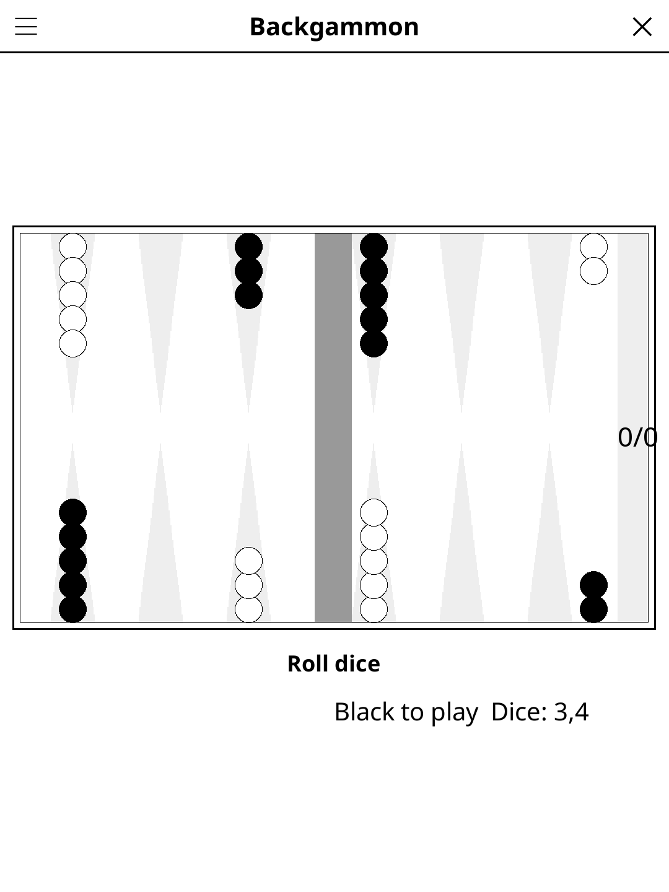

# backgammon.koplugin

A Backgammon plugin for [KOReader](https://github.com/koreader/koreader).

## Screenshot

## Rules

Two players race their 15 checkers around the board and off, moving by the roll of two dice. Landing on a point with a single opposing checker sends it to the bar, from where it must re-enter before any other move is made. The first player to bear off all checkers wins.

## Concept

The classic 2-player dice-and-checker race game, played pass-and-play on a single device.

## Features

- **Computer opponent** — optional, plays Black; enumerates every legal sequence the dice allow and scores the position each one leaves
- **Opening roll** — each side rolls one die, the higher starts
- **Full move validation** — legal moves only, including forced bar re-entry, doubles, and the obligation to use as many dice as possible (the higher one when only one can be played)
- **Automatic turn passing** — when a roll has no legal move
- **Auto-save** — in-progress game restored on next launch

## Controls

| Action | How |
|--------|-----|
| Roll dice | Tap **Roll dice** |
| Move a checker | Tap the origin point, then the destination |
| New game | Tap **New game** |
| Show rules | Tap **Rules** |

## Installation

1. Download `backgammon.koplugin.zip` from the [latest release](../../releases/latest).
2. Extract into the `plugins/` folder of your KOReader data directory.
3. Restart KOReader.
4. Open the menu → **Tools** → **Backgammon**.

## License

GPL-3.0 — see [LICENSE](LICENSE).
